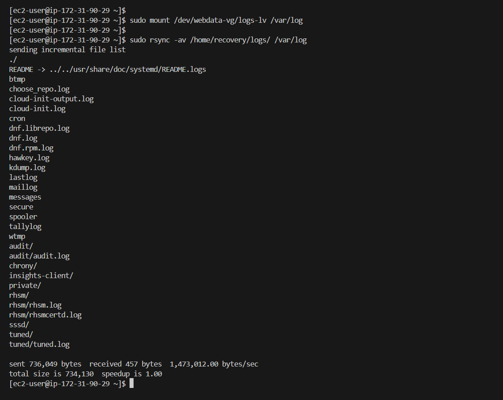
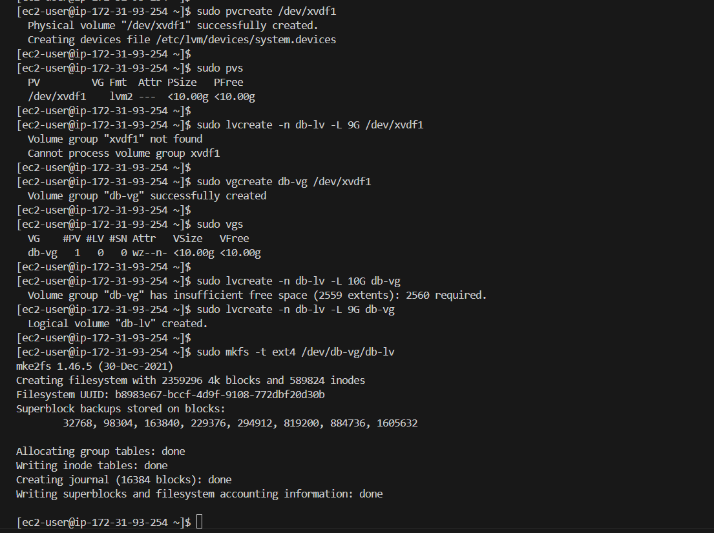
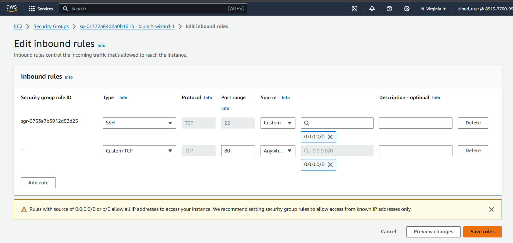

# Project: Deploy a 3-Tier Web Solution Using WordPress and MySQL on AWS EC2

In this project, you will set up the infrastructure for a web solution using WordPress, a popular content management system. You will be using two separate Linux servers: one for the web server and another for the database server.


## Project Overview
The project consists of two main parts:

1. **Configure storage subsystem for Web and Database servers**: Gain hands-on experience with disks, partitions, and volumes on Linux.
2. **Install WordPress and connect it to a remote MySQL database server**: Solidify your skills in deploying web and database tiers of a web solution.

## 3-Tier Setup

1. **Client**: Your local laptop or PC to serve as the client.
2. **Web Server**: An EC2 Linux Server (RedHat OS) where WordPress will be installed.
3. **Database Server**: An EC2 Linux Server (RedHat OS) to act as the database (DB) server.

> **Note:** For this project, we are using RedHat as the Linux distribution. Remember to connect using `ec2-user` instead of `ubuntu`.
   
## Step 1: Prepare the Web Server

1. **Launch an EC2 Instance**: Spin up an EC2 instance that will serve as the Web Server. Create **three volumes** in the same Availability Zone as your Web Server EC2 instance, each with a size of 10 GiB.
   
2. **Attach the EBS Volumes**: Attach all three volumes to your Web Server EC2 instance one by one.
   
   

3. **Inspect Block Devices**:
   - Open the Linux terminal and run the following commands to inspect the block devices:
     ```bash
     lsblk
     ls /dev/
     ```

   
   
4. **Check Mounted File Systems**:
   - Use the following command to see all mounts and free space on your server:
     ```bash
     df -h
     ```
   

5. **Create Partitions Using `fdisk`**:
   - Create a single partition on each of the three disks using `fdisk`:
     ```bash
     sudo gdisk /dev/xvdb
     ```
   - Follow the prompts to create partitions, then repeat for the other disks.

   

6. **View Configured Partitions**:
   - Use the `lsblk` command to view the newly created partitions:
     ```bash
     lsblk
     ```

7. **Install `lvm2`**:
   - Install `lvm2` and check for available partitions:
     ```bash
     sudo yum install lvm2
     sudo lvmdiskscan
     ```

8. **Create Physical Volumes**:
   - Mark each of the three disks as physical volumes (PVs):
     ```bash
     sudo pvcreate /dev/xvdb1
     sudo pvcreate /dev/xvdc1
     sudo pvcreate /dev/xvdd1

     #to check if PVs are created successfully
     sudo pvs
     ```

9. **Create a Volume Group (VG)**:
   - Add all three PVs to a volume group (VG) named `webdata-vg`:
     ```bash
     sudo vgcreate webdata-vg /dev/xvdb1 /dev/xvdc1 /dev/xvdd1

     #to check if VGs are created successfully
     sudo vgs
     ```

10. **Create Logical Volumes (LVs)**:
    - Create two logical volumes:
      - `apps-lv` using half of the VG size.
      - `logs-lv` using the remaining space.
      ```bash
      sudo lvcreate -n apps-lv -L 14G webdata-vg
      sudo lvcreate -n logs-lv -L 14G webdata-vg
      ```

      **Verify the entire setup**
      ```bash
      sudo vgdisplay -v #view complete setup - VG, PV, and LV
      sudo lsblk
      ```

11. **Format the Logical Volumes**:
    - Format the logical volumes with the ext4 filesystem:
      ```bash
      sudo mkfs -t ext4 /dev/webdata-vg/apps-lv
      sudo mkfs -t ext4 /dev/webdata-vg/logs-lv
      ```
   

12. **Create Directories for Mount Points**:
    - Create directories for the web data and logs:
      ```bash
      sudo mkdir -p /var/www/html
      sudo mkdir -p /home/recovery/logs
      ```
   

13. **Mount the Logical Volumes**:
    - Mount the logical volumes to the directories:
      ```bash
      sudo mount /dev/webdata-vg/apps-lv /var/www/html/
      sudo rsync -av /var/log/ /home/recovery/logs/
      sudo mount /dev/webdata-vg/logs-lv /var/log
      sudo rsync -av /home/recovery/logs/ /var/log
      ```
   

14. **Update `/etc/fstab`**:
    - Update `/etc/fstab` so that the mount configuration persists after a server reboot:
      ```bash
      sudo blkid
      sudo vi /etc/fstab
      ```
   
   

15. **Verify Setup**:
    - Verify that the setup is successful:
      ```bash
      sudo mount -a
      sudo systemctl daemon-reload
      df -h
      ```

   

## Step 2: Prepare the Database Server

1. **Launch a Second RedHat EC2 Instance**: Create and connect to a second EC2 instance that will act as the Database (DB) Server.
   

2. **Configure Storage Subsystem**:
   - Repeat the same steps as for the Web Server, but create a single logical volume `db-lv` and mount it to the `/db` directory instead of `/var/www/html`.
   

   

   

   
   
   

   

   

   


## Step 3: Install WordPress on the Web Server

1. **Update Repository**:
   ```bash
   sudo yum -y update
   ```
   

2. **Install Apache and PHP**:
   ```bash
   sudo yum -y install wget httpd php php-mysqlnd php-fpm php-json
   ```
   

3. **Start Apache**:
   ```bash
   sudo systemctl enable httpd
   sudo systemctl start httpd
   ```
   

4. **Install Additional PHP Modules**:
   ```bash
   sudo yum install https://dl.fedoraproject.org/pub/epel/epel-release-latest-8.noarch.rpm
   sudo yum install yum-utils http://rpms.remirepo.net/enterprise/remi-release-8.rpm
   sudo yum module list php
   sudo yum module reset php
   sudo yum module enable php:remi-7.4
   sudo yum install php php-opcache php-gd php-curl php-mysqlnd
   sudo systemctl start php-fpm
   sudo systemctl enable php-fpm 
   sudo setsebool -P httpd_execmem 1
   ```
   

   

   

   


5. **Restart Apache**:
   ```bash
   sudo systemctl restart httpd
   ```

6. **Download and Configure WordPress**:
   ```bash
   mkdir wordpress
   cd wordpress
   sudo wget http://wordpress.org/latest.tar.gz
   sudo tar xzvf latest.tar.gz
   sudo rm -rf latest.tar.gz
   sudo cp wordpress/wp-config-sample.php wordpress/wp-config.php
   sudo cp -R wordpress /var/www/html/
   ```

   


7. **Set SELinux Policies**:
   ```bash
   sudo chown -R apache:apache /var/www/html/wordpress
   sudo chcon -t httpd_sys_rw_content_t /var/www/html/wordpress -R
   sudo setsebool -P httpd_can_network_connect=1
   ```
   

## Step 4: Install MySQL on the Database Server

1. **Install MySQL**:
   ```bash
   sudo yum update
   sudo yum install mysql-server
   ```
   

2. **Start and Enable MySQL Service**:
   ```bash
   sudo systemctl start mysqld
   sudo systemctl enable mysqld
   ```
   

## Step 5: Configure MySQL for WordPress

1. **Create a WordPress Database**:
   ```bash
   sudo mysql
   CREATE DATABASE wordpress;
   CREATE USER 'myuser'@'<Web-Server-Private-IP-Address>' IDENTIFIED BY 'mypass';
   GRANT ALL ON wordpress.* TO 'myuser'@'<Web-Server-Private-IP-Address>';
   FLUSH PRIVILEGES;
   SHOW DATABASES;
   exit
   ```
   


## Step 6: Connect WordPress to the Remote Database
 On your Web Server:
1. **Install MySQL Client**:
   ```bash
   sudo yum install mysql
   sudo mysql -u myuser -p -h <DB-Server-Private-IP-Address>
   ```
   
   

2. **Verify the Connection**:
   - Run the following command to verify that the connection is successful:
     ```bash
     SHOW DATABASES;
     ```

3. **Access WordPress**:
   - Open your browser and navigate to `http://<Web-Server-Public-IP-Address>/wordpress/`.
   

4. **Complete WordPress Setup**:
   - Follow the on-screen instructions to complete the WordPress setup.

   

5. **Secure Your EC2 Instances**:
   - Stop your EC2 instances to avoid extra costs.


**Congratulations!** You have successfully deployed a 3-tier web solution using WordPress and MySQL on AWS EC2.